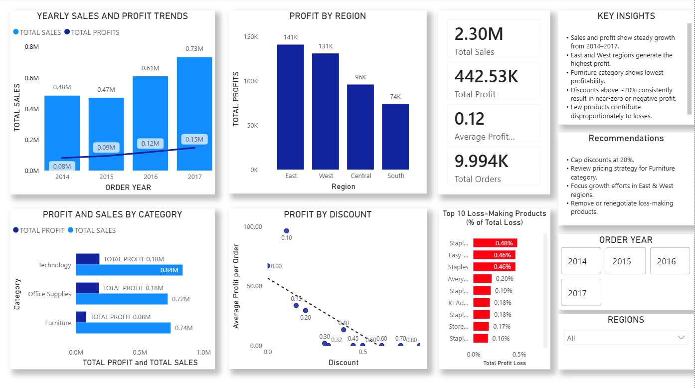

\# 📊 Sales Performance \& Profitability Analysis (Superstore Data)

\## 📌 Project Overview

This project analyzes retail sales data to evaluate \*\*revenue trends, profitability drivers, regional performance, and the impact of discounting\*\*.

The objective is to uncover \*\*business insights\*\* that can help improve profit margins and reduce losses.

---

\## 🎯 Project Objective

\* Understand sales and profit behavior over time

\* Identify underperforming regions and product categories

\* Analyze the effect of discounts on profitability

\* Detect products that consistently generate losses

\* Provide \*\*actionable business recommendations\*\*

---

\## ❓ Business Questions

1\. How do sales and profit change year over year?

2\. Which regions underperform in terms of profitability?

3\. Which product categories are most and least profitable?

4\. How do discounts affect profit margins?

5\. Which products contribute the most to total losses?

---

\## 📂 Dataset

\* \*\*Superstore.csv\*\*

&nbsp; Retail transactional dataset containing orders, customers, regions, categories, sales, discounts, and profit.

---

\## 🛠 Tools \& Technologies

\* \*\*Power BI\*\* – Data modeling, DAX measures, interactive dashboards

\* \*\*Excel\*\* – Initial data inspection and validation

\* \*\*Python\*\* – Data analysis and minor preprocessing

---

\## 🔍 Key Insights

\* Sales and profit show \*\*consistent growth from 2014–2017\*\*, with a minor dip (~2%) in 2015.

\* \*\*East and West regions\*\* generate the highest profits.

\* \*\*Central and South regions\*\* consistently underperform.

\* \*\*Furniture\*\* is the least profitable category despite high sales volume.

\* Discounts \*\*below 30%\*\* generally maintain profitability.

\* Discounts \*\*≥30%\*\* lead to significant profit erosion and losses.

\* A small number of products account for a \*\*disproportionate share of total losses\*\*.

---

\## 🔄 Project Workflow

1\. Imported CSV data into Power BI

2\. Cleaned column names and corrected data types

3\. Created date hierarchy (Year, Month)

4\. Built KPIs using DAX:

&nbsp;  \* Total Sales

&nbsp;  \* Total Profit

&nbsp;  \* Average Profit Margin

&nbsp;  \* Total Orders

5\. Analyzed trends by Year, Region, and Category

6\. Studied discount impact on profitability

7\. Identified top loss-making products

8\. Designed an interactive dashboard with slicers

9\. Generated business insights and recommendations

---

\## 📈 Dashboard Preview

\*\*

---

\## 💡 Business Recommendations

\* Cap discounts at \*\*20–30%\*\* to protect profit margins

\* Review pricing and cost structure for \*\*Furniture\*\* category

\* Focus growth strategies on \*\*East and West regions\*\*

\* Remove, renegotiate, or reprice persistent loss-making products

---

\## 📁 Files in Repository

\* `Superstore.csv` – Dataset

\* `Sales\_Performance\_Analysis.pbix` – Power BI dashboard file

\* `README.md` – Project documentation

---

\## 🚀 Author

\*\*Chetan Suraswal\*\*

Aspiring Data Analyst | Power BI | Python | SQL 

